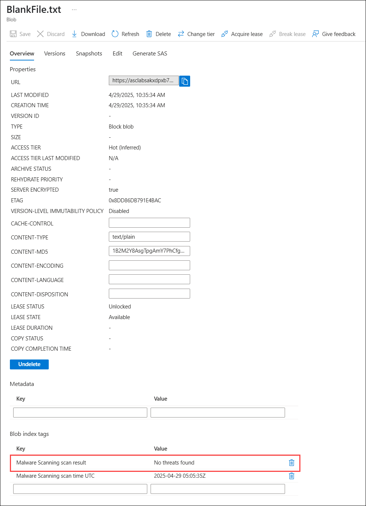

# Module 2: Securing Azure Storage with Microsoft Defender 

## Overview:

In this lab, you will explore how to secure your Azure Storage Accounts by enabling Defender for Storage, detecting and mitigating malware, and automating responses to security alerts. You'll learn how to protect your storage environment using advanced security features, including container management, file uploads, and security alert handling. By the end of the lab, you'll understand how to monitor, detect, and respond to threats in your storage accounts, ensuring your data remains secure.

## Estimated Duration: 40 min

## Lab Objectives: 

In this lab, you will complete the following tasks:

- Task 1: Preparing the Environment for Defender for Storage plan
- Task 2: Create a container within the Storage Account
- Task 3: Create blank File
- Task 4: Upload Malware to a Storage Account
- Task 5: Security Alert
- Task 6: KQL To See Scan Results
- Task 7: Automate The Removal of Malware with Logic Apps
- Task 8: Create workflow automation for Microsoft Defender for Cloud alerts

### Task 1: Preparing the Environment for Defender for Storage plan

In this task, you will learn how to enable the Defender for Storage plan on a specific subscription within Microsoft Defender for Cloud.

1. In the search bar, type **Defender for Cloud (1)** and select **Microsoft Defender for Cloud (2)** from the results.

   

1. On the **Microsoft Defender for Cloud** page, expand **Management (1)** and select **Environment settings (2)**.

   
   
1. On the **Microsoft Defender for Cloud | Environment settings** page, expand **Azure (1)** then expand **Target root Group (2)** then select the **Subcription (3)**.

   

1. To verify the Defender for Cloud configuration, navigate to **Settings | Defender plans**, enable the **Storage** plan by clicking **On**, and then click **Save (2)** to apply the changes.

   

1. Click on **Settings** located in the Monitoring Coverage column, below **Full**.

1. In the **Malware scanning** component, make sure the toggle is **ON** and for the limit of GB scanned per month per storage account, leave the default value of 1000 or click on **Edit configuration** to modify it.

1. In the **Sensitive data discovery** component, make sure the toggle is **ON**.

1. Select **Continue** and in the next screen **Save**.

### Task 2 : Create a container within the Storage Account

In this task, you will learn how to create a container within a storage account to organize and store your data efficiently.

1. In the search bar, type **Storage Account (1)** and select **Storage Account (2)** from the results.

   

1. Under **Storage Accounts**, select storage account named **asclabsxxxxxxxx**.

   

1. Navigate to the **Configuration** section under **Setting** in the left-hand panel. Ensure that both **Allow Blob anonymous access (1)** and **Allow storage account key access (2)** options are **enabled**. If either option is disabled, enable it and click **Save (3)** to apply the changes.

   
  
1. From the left panel, select **containers (1)** under Data storage then select **+ Container (2)**.
  
   

1. Enter the name **jwdnewcontainer (1)**, choose **Blob (2)** as the Anonymous access level from the drop-down menu, and then click **Create (3)**.

   

> **Congratulations** on completing the task! Now, it's time to validate it. Here are the steps:
- If you receive a success message, you can proceed to the next task.
- If not, carefully read the error message and retry the step, following the instructions in the lab guide.
- If you need any assistance, please contact us at cloudlabs-support@spektrasystems.com. We are available 24/7 to help you out.
 
<validation step="5d5c3ca1-9d4b-4c77-a098-7f29bf17eef8" />

## Task 3: Create blank File

In this task, you will learn how to create and save a blank file using Notepad.
 
1. To open Notepad, click the **Start** button **(1)** in the lab-VM, select the **Search** icon **(2)**, type **notepad** in the search bar **(3)**, and click on the **Notepad** app from the search results **(4)**.

   

1. Save file in Notepad, by clicking on **File (1)** in the menu bar, then select **Save As... (2)** from the dropdown menu.

    
    
1. In the Save As window, enter **BlankFile (1)** name in the **File name** field , then click the **Save (2)** button to save your Notepad file. 

   

## Task 4: Upload Malware to a Storage Account

In this task, you will learn how to upload a file to an Azure Storage Account and check how Microsoft Defender for Storage detects malware.

1. In the search bar, type **Storage Account (1)** and select **Storage Account (2)** from the results.

   

1. Under **Storage Accounts**, select storage account named **asclabsxxxxxxxx**.

   

1. Navigate to **Microsoft Defender for Cloud (2)** under **Security + Networking (1)**, and check the status for the selected storage account. Ensure that **Defender for Storage (3)** is enabled for the selected storage account.

   

1. From the left panel, select **containers (2)** under **Data storage (1)** and select **jwdnewcontainer (2)** from the list.

   

1. To upload a file to the container named **jwdnewcontainer**, click on the **Upload** button highlighted in the toolbar.

   

1. To select a file for upload, either drag and drop it into the designated area or click on **Browse for files** to choose a file from your system.

    

1. To upload a file, navigate to the **Documents (1)** folder, select the desired file **BlankFile (2)** , and click **Open (3)** to proceed with the upload.

   

1. On the **Upload blob** page, click on **Upload**.

   

1. Select the **BlankFile** file you just uploaded.

    

1. On the Overview tab, scroll down to the **Blob index tags** section. You'll see that the value for the malware scanning scan result is **No threats found**.

   

1. Select **Edit (1)** and paste `X5O!P%@AP[4\PZX54(P^)7CC)7}$EICAR-STANDARD-ANTIVIRUS-TEST-FILE!$H+H*
` **(2)** then click on **Save (3)**.

   

9. Navigate back to the **Overview (1)** tab and scroll down to **Blob index tags (2)**. The file has been detected as **Malicious**.

   

## Task 5: Security Alert

In this task, you will learn how to navigate Microsoft Defender for Cloud to view and investigate a security alert related to a malicious file uploaded to a storage account.

1. In the search bar, type **Defender for Cloud (1)** and select **Microsoft Defender for Cloud (2)** from the results.

   

2. Select **Security alerts (1)** on the left panel and Click on the alert **Malicious file uploaded to storage account (2)**.

   

3. On the **Malicious file uploaded to storage account** page, select **View full details**.

    

4. The security alert provides detailed information about the file, the type of malware detected, and recommended steps for investigation and remediation.

   

## Task 6: KQL To See Scan Results

In this task, you will learn how to use KQL (Kusto Query Language) to view scan results within Microsoft Defender for Cloud and Log Analytics.

1. In the search bar, type **Defender for Cloud (1)** and select **Microsoft Defender for Cloud (2)** from the results.

   

1. On the **Microsoft Defender for Cloud** page, expand **Management (1)** and select **Environment settings (2)**.

   
   
1. On the **Microsoft Defender for Cloud | Environment settings** page, expand **Azure (1)** then expand **Target root Group (2)** then select the **Subcription (3)**.

   

1. In the Microsoft Defender for Cloud portal, navigate to the **Settings | Defender plans** page and select **Continuous export (1)**.

1. Under **Continuous export**, choose **Log Analytics workspace(2)**.

1. Toggle the **Export enabled** switch to **On(3)**.

1. Enable the following data types and configure their options **(4)**:
     - **Security recommendations**: All recommendations selected.
       - Recommendation severity: Low, Medium, High.
       - Include security findings: Yes.
     - **Secure score**: Overall score, Control score.
     - **Controls**: All controls selected.
     - **Security alerts**: Low, Medium, High, Informational.
     - **Regulatory compliance**: All standards selected.
     - **Security attack paths**: All risk levels selected.

1. Choose the appropriate **Resource group** (e.g., `ascdab`) **(5)**.

1. Select your target **Subscription** (e.g., `OTU WA HOL`) **(6)**.

1. Choose the **Log Analytics Workspace** under the selected subscription (e.g., `ascdab-la...`) **(7)**.

1. Click the **Save** button at the top of the page to apply your configuration **(8)**.

   
   
1. In the search bar, type **Storage Account (1)** and select **Storage Account (2)** from the results.

   

1. Under **Storage Accounts**, select storage account named **asclabsxxxxxxxx**.

   

1. Go to **Monitoring (1) > Diagnostic settings (2)**, select the **asclabs (3)** storage account under your **resource group and subscription**, and view or configure diagnostic settings.

   

1. Click **+ Add diagnostic setting** to configure log.

   

1. To configure diagnostic settings add below details then click on **Save (6)**:

   - Diagnostic setting name: Enter  **MalwareScanningResults (1)**.  
   - Check **Send to Log Analytics workspace (2)**.  
   - Select the appropriate **Subscription (3)**.  
   - Choose the desired **Log Analytics workspace (4)**.  
   - Select the **Transaction (5)** metric.    

     

1. In the search bar, type **Monitor (1)** and select **Monitor (2)** from the results.

   

1. From the left-hand panel, select **Logs (1)**, then close the **Welcome to Log Analytics** pane by clicking the **X (2)**. 

   

1. Under **Select a scope**, choose **asclab-la-<inject key="DeploymentID" enableCopy="false"/> (1)** under the **aslab** resource group, then click **Apply (2)**.

   

1. From the right side, click on **Simple mode (1)** and then Select **KQL mode (2)**.

   

1. Enter the following query, click **Run** (2), and observe the results.

   ```
   StorageMalwareScanningResults 
   | sort by TimeGenerated asc
   ```

   

   >**Note:** The logs may take 12-14 hours to appear.

## Task 7: Automate The Removal of Malware with Logic Apps

In this task, you will learn how to automate the removal of malware from a storage account by using Microsoft Defender for Cloud and Logic Apps.

1. Open a new tab and navigate to the [Delete Blob LogicApp Defender for Storage](https://github.com/Azure/Microsoft-Defender-for-Cloud/tree/main/Workflow%20automation/Delete%20Blob%20LogicApp%20Defender%20for%20Storage) page.

1. Under **Logic App based on Microsoft Defender for Cloud security alerts**, click **Deploy to Azure**.

   

1. Under **Custom deployment**, select the **defenderforcloud (1)** resource group, then click **Review + create (2)** .

   

1. On the **Review + Create** tab, click on **Create**.

   

1. Once the deployment is complete, click on **Go to the resource group**.

   

1. Select the **Remove-MalwareBlob** Logic App under **Resources**.

   

1. Navigate to **Settings (1)** and select **Identity (2)** from the list.

1. Choose **System assigned (3)** and make sure the Status is set to **On (4)**.

1. Set the Permissions by clicking **Azure role assignments (5)**.

   

1. On the **Azure role assignments** page, select **+ Add role assignment (preview) (1)**, set the **subscription (2)** as the scope, select the subscription and choose **Storage Blob Data Contributor (3)** for the role. Then, click **Save (4)**. 

   

1. In the search bar, type **Defender for Cloud (1)** and select **Microsoft Defender for Cloud (2)** from the results.

   

1. Select **Security alerts (1)** on the left panel and Click on the alert **Malicious file uploaded to storage account (2)**.

   

1. On the **Security alert** page, select **Next: Take Action >>** at the bottom.

   

1. Under **Take actions**, expand **Trigger automated response (1)** and select **Trigger Logic App (2)**.

   
   
1. Under Trigger a logic app, choose the **Remove-MalwareBlob (1)** logic app and then click **Trigger (2)**.

   

1. In the search bar, type **Storage Account (1)** and select **Storage Account (2)** from the results.

   

1. Under **Storage Accounts**, select storage account named **asclabsxxxxxxxx**.

   

1. From the left panel, select **containers (2)** under **Data storage (1)** and select **jwdnewcontainer (2)** from the list.

   

1. You will notice that the file is gone; **blankFile.txt** is no longer present.

      

## Task 8: Create workflow automation for Microsoft Defender for Cloud alerts

In this task, you will learn how to create workflow automation in Microsoft Defender for Cloud to automatically detect and remove malware from storage accounts.

1. In the azure portal, Search **Defender for cloud (1)** and select **Microsoft Defender for Cloud (2)**.

   

1. Expand **Management (1)** and select **Workflow Automation (2)**. On the **Workflow Automation** screen, click **+ Add workflow automation (3)** .

   

1. On the **Add Workflow Automation** screen, fill in the following details, then click **Create (6)**:

   | Setting  | Value |
   -----------|---------
   | Name | **autoRemoveMalware (1)** |
   | Resource group | **asclab (2)** |
   | Defender for Cloud data type | **Security Alert (3)** |
   | Recommendation name| **Malicious file uploaded to storage account (4)** |
   | Logic App name | **Remove-MalwareBlob (5)** |

   

1. The workflow automation has been implemented to automatically detect and remove malware. This process ensures seamless malware elimination without manual intervention, improving security efficiency.

   

### **Summary:**

By completing this lab, you will have gained practical experience in securing Azure Storage Accounts using Microsoft Defender for Storage. You will know how to enable the Defender for Storage plan, create storage containers, upload and detect malware, and automate the response to security threats with Logic Apps. These steps help maintain a high level of security for your storage environments, ensuring rapid identification and mitigation of potential risks.

## You have successfully completed the lab
