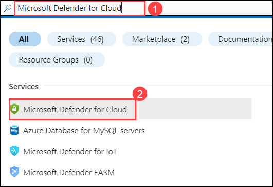
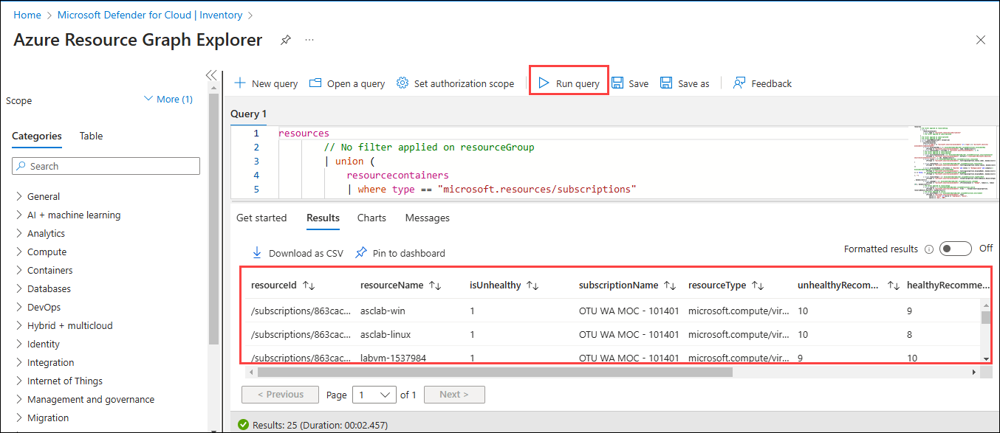
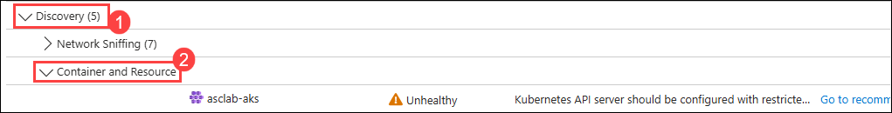

### Task 1: Accessing Microsoft Defender for Cloud

In this task, you will navigate to **Microsoft Defender for Cloud** to begin managing your environment’s security policies.

1. In the **Azure Portal**, go to the top search bar and type **Microsoft Defender**.

2. From the dropdown search results, select **Microsoft Defender for Cloud**.

   

3. This will open the **Overview** dashboard, where you can manage security posture, regulatory compliance, and policy settings.

### Task 2: Navigating to Environment Settings

In this task, you will access the **Environment settings** section to view all your subscriptions connected to Microsoft Defender for Cloud.

1. In the left-hand menu of **Defender for Cloud**, scroll down and click on **Environment settings (1)** under the **Management** section.

   

2. You will see a list of **subscriptions** and **management groups** currently onboarded to Defender for Cloud.

3. Select the **Subscription (1)** you want to configure security policies for.

   

### Task 3: Viewing Security Policy

In this task, you will access the security policy assigned to the selected subscription.

1. After selecting the subscription, navigate to the **Security policy (1)** tab.

   

2. You will see the **Azure Policy initiative** currently assigned. This includes built-in policies like **ASC Default** or **Azure Security Benchmark**.

3. Review the listed controls and their assignment scope (subscription/resource group).

### Task 4: Understanding Policy Structure

In this task, you will understand how security policies are structured in Microsoft Defender for Cloud.

1. Each **security policy** is made up of one or more **Azure Policy initiatives**.

2. These initiatives contain multiple **policy definitions**, such as:

   * Enforce secure transfer on storage accounts
   * Audit missing diagnostic settings
   * Require encryption on SQL servers

3. These policies have **effects** (e.g., Audit, Deny, DeployIfNotExists) and define what is monitored or enforced in your environment.

   

### Task 5: Customizing and Assigning Policy Initiatives

In this task, you will learn how to create and assign custom policy initiatives for enhanced control.

1. Navigate to the **Azure Policy** service from the Azure Portal.

2. Click **Definitions (1)** → Select an existing initiative (e.g., Azure Security Benchmark) or click **+ Initiative definition** to create a new one.

3. Define a name, select **Policy definitions**, and assign parameters as required.

4. Go to **Assignments (1)** → Click **+ Assign initiative (2)**.

   

5. Select:

   * **Scope**: Choose subscription or management group

   * **Initiative definition**: Select your custom or built-in policy initiative

   * **Parameters**: Configure any custom inputs (like allowed locations)

   * Click **Next → Review + Create → Create**

   > **Note:** It may take a few minutes for the policies to evaluate and apply across resources.

### Task 6: Viewing Compliance Results

In this task, you will view policy compliance across resources using the **Regulatory compliance** dashboard.

1. Go back to the **Microsoft Defender for Cloud** dashboard.

2. From the left-hand menu, click **Regulatory compliance (1)**.

   

3. Here, you can:

   * See overall compliance score
   * Drill down by standard (e.g., ISO 27001, Azure CIS)
   * Review failed controls and associated non-compliant resources

   

### Task 7: Remediating Non-compliant Resources

In this task, you will explore how to fix policy violations directly from Defender for Cloud.

1. In the **Regulatory compliance** blade, click on a **non-compliant control**.

2. Select the affected **resource** to view the issue details.

3. You can either:

   * Use **Quick Fix/Remediate** button (if available), or

   * Follow the **manual remediation steps** provided in the UI.

   > **Example:** If the policy requires diagnostic logs to be enabled, you can turn them on directly from the blade.

   

### Task 8: Governing Policies at Scale Using Management Groups

In this task, you’ll apply policies at a broader level using management groups.

1. From the Azure Portal, search for and open **Management Groups**.

2. Select a management group that contains multiple subscriptions.

3. Follow **Task 5** again to assign a **policy initiative** at the management group level.

   * This ensures that **all child subscriptions inherit the same security policies**.

   > **Tip:** Use this approach for organizations with multiple teams or departments for consistent governance.

### Task 9: Enable Defender Plans for Full Coverage

In this task, you’ll ensure advanced threat protection by enabling **Defender plans**.

1. From the **Environment settings** of your subscription, scroll down to find the **Defender plans** section.

2. Toggle on required protections such as:

   * **Defender for Servers**
   * **Defender for SQL**
   * **Defender for Key Vault**
   * **Defender for Storage**

3. Click **Save** to enable the selected Defender plans.

   

   > **Note:** Enabling these plans may incur additional Azure charges based on usage.

### Summary

By completing these tasks, you have:

* Accessed Microsoft Defender for Cloud
* Viewed and understood existing security policy assignments
* Applied custom policy initiatives for compliance
* Used regulatory compliance views to monitor posture
* Enabled Defender plans to enhance protection

These steps help ensure consistent, organization-wide enforcement of security best practices and regulatory standards.

