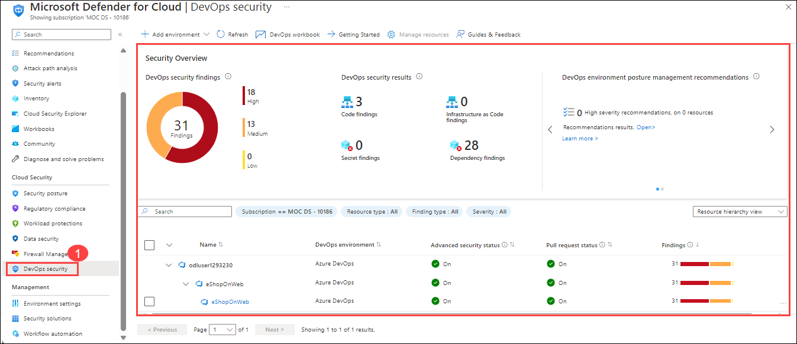

# Module 1: Securing Code Repositories with Microsoft Defender for Cloud 

## Overview:
In this lab, you'll 

## Estimated Duration: 60 Minutes

## Lab Objectives :

In this lab, you will complete the following tasks:

- Task 1: Understanding CI/CD pipelines in Azure DevOps
- Task 2: Identifying security issues in the pipeline
- Task 3: Securing your pipeline with GHAS
- Task 4: Connecting and Securing your Azure DevOps environment to MDC

## Task 1: Understanding CI/CD pipelines in Azure DevOps

Continuous Integration and Continuous Deployment (CI/CD) are critical practices in modern software development, enabling teams to deliver code changes more frequently and reliably. Azure DevOps provides a robust platform to implement CI/CD pipelines. Here’s a basic understanding and a simple pipeline example to get you started.

**CI/CD Pipelines in Azure DevOps:**

   - **Continuous Integration (CI):**
   CI involves automatically building and testing your code every time a team member commits changes to version control. The key goals are to detect errors quickly and to improve software quality.

   - **Continuous Deployment (CD):**
   CD extends CI by automatically deploying all code changes to a production environment after the build and test stages are successful. This ensures that the software is always in a releasable state.

**Components of a CI/CD Pipeline:**

  - **Source Control:** Where the code resides (e.g., Git repository).
  - **Build:** The process of compiling the source code into executable artifacts.
  - **Test:** Automated tests run to validate the code.
  - **Release:** Deploying the artifacts to staging or production environments.

### 1. Set up an Azure DevOps organization

1. On your lab VM open **Edge Browser** on desktop and navigate to [Azure DevOps](https://go.microsoft.com/fwlink/?LinkId=307137), and if prompted sign with the credentials.

   * Email/Username: <inject key="AzureAdUserEmail"></inject>

   * Password: <inject key="AzureAdUserPassword"></inject>

      > **Note:** If you encounter an access issue, which is expected to be rare, please attempt to log in again.

1. If prompted click **Ask later** on **Action Required** page.

3. On the next page, accept the defaults and click on continue.
   
   
   
1. On the **Almost Done...** page, fill in the captcha and click on continue. 

   
    
1. On the Azure DevOps page, click on **Azure DevOps** located at the top left corner and then click on **Organization Setting** at the left down corner.

   .png)
    
1. In the **Organization Setting** window on the left menu click on **Billing (1)** .

   

1. Select **Setup Billing (2)** then click on **save (3)**.

       

1. On the **MS Hosted CI/CD (1)** section under **Paid parallel jobs** enter value **1** and at the end of the page click on **Save (2)**.

   

1. On the **Organization Settings** page, go to the Security section and click **Policies (1)** . Enable the toggles for both **Third-party application access via OAuth (2)**  and **Allow public projects (3)**.

   

1. In the **Organization Settings** window, click on **Settings (1)** in the left menu. On the settings page, toggles for **Creation of Classic Release Pipeline (2)** option.

   `
  
1. Navigate to **azuredevopsdemogenerator** using the link below. This utility site will automate the process of creating a new Azure DevOps project within your account that is prepopulated with content (work items, repos, etc.) required for the lab. For more information on the site, please see [https://docs.microsoft.com/en-us/azure/devops/demo-gen](https://docs.microsoft.com/en-us/azure/devops/demo-gen).

   ```
   https://azuredevopsdemogenerator.azurewebsites.net/
   ```

   

1. Since authentication is disabled, follow the steps below to create the project.

1. Navigate to the Azure Devops Organization portal, then click on **User settings (1)** and select **Personal access tokens (2)**.

   

1. Select **+ New Token**.

   

1. On **Create a new personal access token** window, enter the below values and click on **Create (3)**.

    | Setting | Value |
    |----------|-------|
    | Name | **Demogenerator (1)** |
    | Scopes | **full access (2)** |

    

1. Once you've generated the token, click on the **Copy** icon to the right of the secret value in the notepad. Once copied, click on **Close**.

   .png)

1. On the LabVM, Open the Start menu **(1)** and search for **Visual Studio 2022 (2)**. Select **Visual Studio 2022 (3)** to run it.

    

   >**Note**: If prompted to sign in to Visual Studio, click **Skip for now, and add an account later.**

     

   > If prompted to choose **Development settings**, simply click **"Start Visual Studio"** to proceed.

     

1. Select the **Clone a repository** option from the Get started.

   

1. Provide the below URL **(1)** for Repository location and select **Clone (2)**.

   ```
   https://github.com/microsoft/AzDevOpsDemoGenerator/
   ```
    

   >**Note:** If prompt visual studio installer then click on **Install** and then close Visual Studio Installer window.

   

1. Switch to **Solution Explorer**, right-click on **ADOGenerator (2)** project, and select **Set as Starer Project (3)**.

   

1. Right-click on the **ADOGenerator (1)** solution file and select **Build solution (2)**.

   

1. Wait for the build to **complete (1)**, then select **Start (2)** from the top menu to run the project.

   

1. When prompted, enter the following details to create the **eShopOnWeb** project in your Azure DevOps organization.

   | Settings | Value |
   ---------|---------
   | Do you want to create a new template or create a new project using the demo generator project template? | Enter *1* to select Create a new project using the demo generator project template | 
   |Enter the template number from the list of templates above | Enter *1* to select the eShopOnWeb template |
   |Choose authentication method | Enter *2* for PAT authentication |
   |Enter your Azure DevOps organization name | Enter **odluser<inject key="DeploymentID" enableCopy="false"/>** |
   |Enter your Azure Devops Personal access token | Copy and paste the **PAT Token** from the notepad |
   |Enter the new project name | Enter **eShopOnWeb** |

    

1. Once you see the **Project created successfully** message, you can navigate to your organization to confirm that the project has been created.
 
    

1. Click on **Repos** > **Branches**, then click the ellipsis next to your branch and select **Branch security**.

   

1. Select **Project Administrators** and set **Bypass policies when pushing** to **Allow** and click on **X** button.

   

### 2. Create a Simple HTML File

1. Click on **Repos (1)>Files (2)**, and click on the three-dot menu (`...`) in the top-right corner of the repository's file explorer section. This menu provides additional actions you can take within the repository.

1. Click the three-dot menu (1) to open a drop-down list. Hover over the **New** option, and under the **+ New (2)** submenu, select **File (3)** to begin creating a new file in the repository.

   

1. A prompt will appear asking you to name your new file.

2. Enter a name for your HTML file, such as `index.html`.

   

1. Add the following content to the `index.html` file:

    ```html
    <!DOCTYPE html>
    <html>
    <head>
        <title>My Simple HTML Page</title>
    </head>
    <body>
        <h1>Hello, Azure DevOps!</h1>
        <p>This is a simple HTML page used to demonstrate CI/CD pipelines.</p>
    </body>
    </html>
    ```

1. After writing your code, you can commit the changes by filling in the commit message and selecting whether to commit directly to the main branch or a different one.

1. Click **Commit** to save the file to your repository.

1. Navigate back to the **Pipelines** pane in of the **Pipelines** hub.

1. In the **Pipelines** window, click **New pipeline**.

   > **Note**: We will use the wizard to create a new YAML Pipeline definition based on our project.

1. On the **Where is your code?** pane, click **Azure Repos Git (YAML)** option.

   

1. On the **Select a repository** pane, click **eShopOnWeb**.

   

1. On the **Configure your pipeline** pane, scroll down and select **Starter pipeline**.

   

1. Define your build pipeline in a file named `azure-pipelines.yml` with the following content:

   ```yaml
   trigger:
   - main

   pool:
     vmImage: 'ubuntu-latest'

   steps:
   - task: UsePythonVersion@0
     inputs:
       versionSpec: '3.x'
     displayName: 'Set up Python'

   - script: |
      echo "Building the HTML project..."
      mkdir output
      cp index.html output/
     displayName: 'Build Project'

   - task: PublishBuildArtifacts@1
     inputs:
       pathToPublish: 'output'
       artifactName: 'html-artifact'
     displayName: 'Publish Artifacts'
   ```
1. This YAML file does the following:
   - **Trigger**: Runs the pipeline when changes are pushed to the `main` branch.
   - **Pool**: Uses an Ubuntu VM image for the build.
   - **Steps**:
   - Set up Python (although not used in this case, you might need it for other tasks).
   - Create a directory called `output` and copy `index.html` to it.
   - Publish the contents of `output` as build artifacts.
   
8. Click **Save and Run** then click **Save and Run** to start the Build Pipeline process.

   

9. Wait for the Build Pipeline to complete successfully.

   > **Note**: Each task from the YAML file is available for review, including any warnings and errors.

### 3. Create a Release Pipeline

1. Go to **Pipelines** > **Releases** > **New pipeline**.

   

1. In the **Select a template** window, choose **Azure App Service Deployment** from the **Featured** list of templates, then click **Apply**.

   

1. Click on **Add an Artifact(1)** tab and select the **eShopOnWeb (2)**  in the Source (build pipeline) field. Click **Add (3)** to confirm the selection of the artifact.

   

1. On the All pipelines > New Release Pipeline pane, Click on **Tasks (1)** tab and ensure that the **Stage 1 (2)** is selected. In the **Azure subscription(3)** dropdown list click on **Authentication**. Confirm the App Type is set to **Web App on Windows(4)**. Next, in the App Service name dropdown list, select the name of the **asclab-app (5)** web app. Click on **Save (6)**.

   

   >**Note**: After selecting your Azure subscription, click Authorize. If prompted, authenticate by using the user account with the Owner role in the Azure subscription.

1. Right-click on **Deploy Azure App Service (1)** and choose **Disable selected task(s) (2)**.

   

1. Click on the **+ (1)** next to Run an agent to add a task. Then, search for **Azure App Service Deploy (2)** and select **Azure App Service Deploy (3)** from the list.

   

1. Select the **Azure App Service Deploy (1)** task, then choose the **Azure subscription (2)** from the drop-down menu. Next, select the **App Service name (3)** and, in the **Package or Folder (4)** field, select **Package or Folder**. 

   

   >**Note:** To select the **Package or Folder** field, choose **Package or Folder** and then follow the steps provided in the image below.

    

1. On the **All pipelines > New Release Pipeline** pane, click **Save**.

   

1. In the **Save** dialog box, review your selections and click **OK** to confirm and finalize the saving process.

   

1. On the **All pipelines > New Release Pipeline** pane, click **Create release** then click on **Create**.

   
   
   

1. Wait until the release pipeline is completed.

   

1. Navigate to the Azure portal interface, navigate to the resource group **asclab**, and in the list of resources, click the **asclab-app-xxxxxxxxxxxxx** web app.

1. On the web app blade, click **Browse**.

   

1. Verify that the web page loads successfully in a new web browser tab.

   

> **Congratulations** on completing the task! Now, it's time to validate it. Here are the steps:
   - If you receive a success message, you can proceed to the next task.
   - If not, carefully read the error message and retry the step, following the instructions in the lab guide.
   - If you need any assistance, please contact us at cloudlabs-support@spektrasystems.com. We are available 24/7 to help you out.
 
<validation step="d1bea6eb-b9ab-4f67-8bbd-f90e80f58b8e" />

## Task 2: Identifying security issues in the pipeline

Integrate Microsoft Security DevOps into your Azure DevOps pipeline to scan Infrastructure as Code (IaC) templates for security issues. This process ensures early detection of vulnerabilities, enhances compliance, and improves your overall security posture within existing DevOps workflows.

1. Click on **Repos (1)>Files**, and then click on the three-dot menu (`...`) in the top-right corner of the repository's file explorer section. This menu provides additional actions you can take within the repository.

1. After clicking the three-dot menu, a drop-down list appears. From this list, hover over the **New** option. This will allow you to create new items in the repository.

1. Under the **New** submenu, you have the option to create a "File" or a "Folder." In this case, you would click on **Folder** to start creating a new Folder within the repository.

1. A prompt will appear asking you to name your Folder and File.

2. Enter a name for your Folder, such as `terraform`, and a file name, such as `ask.tf`.

   

1. Add the following content to the `ask.tf` file:

   ```
   resource azurerm_kubernetes_cluster "k8s_cluster" {
   dns_prefix          = "terragoat-${var.environment}"
   location            = var.location
   name                = "terragoat-aks-${var.environment}"
   resource_group_name = azurerm_resource_group.example.name
   identity {
     type = "SystemAssigned"
   }
   default_node_pool {
     name       = "default"
     vm_size    = "Standard_D2_v2"
     node_count = 2
   }
   addon_profile {
     oms_agent {
       enabled = false
    }
     kube_dashboard {
      enabled = true
     }
   }
   role_based_access_control {
     enabled = false
   }
   tags = {
     git_commit           =  "898d5beaec7ffdef6df0d7abecff407362e2a74e"
     git_file             = "terraform/azure/aks.tf"
     git_last_modified_at = "2020-06-17 12:59:55"
     git_last_modified_by = "nimrodkor@gmail.com"
     git_modifiers        = "nimrodkor"
     git_org              = "bridgecrewio"
     git_repo             = "terragoat"
     yor_trace            =  "6103d111-864e-42e5-899c-1864de281fd1"
    }
   }
   ```
1. After writing your code, add a commit message, then choose whether to commit directly to the main branch.

1. Click **Commit** to save the file to your repository.

1. Navigate back to the **teraform** folder and click on the three-dot menu (`...`) in the top-right corner of the repository's file explorer section.

1. Click on the three-dot menu to open a drop-down list. From the list, select the **Upload file(s)** option to upload files to the repository.

    

1. Click the **Browse** button in the Commit window to select files for upload.

   

1. Navigate to the `C:\Allfiles\terraform-file` folder, select all files, and click **Open**.

1. Click on **Commit** button in the Commit window to select files for upload.

   

1. Navigate to **Github** using the link below. 

   ```
   https://github.com/login
   ```
1. In the sign-in to the GitHub page in the edge browser, enter the **GitHub UserEmail** and **GitHub Password** and click on **Sign in**.

   

   >**Note**: Navigate to the **Environment** tab to view the key-value pairs of the **GitHub UserEmail**, and **GitHub Password** in the **license** section. You can use the copy buttons under the actions column to have the values copied instantly. Alternatively, it is suggested to have the values copied over onto a notepad for easy accessibility. 

     

1. Open a new tab and navigate to `https://www.microsoft.com/en-us/microsoft-365/outlook/log-in` then click on **Sign-in**.

   

1. You'll see the **Sign into Microsoft Outlokk** tab. Here, enter your credentials:
 
   - **Email/Username:** 
 
      
 
1. Next, provide your password:
 
   - **Password:** 
 
      

1. The email containing the verification code can sometimes creep into the archive/spam folders within your Outlook. Copy the verification code.

   

1. Navigate back to the **Device Verifition** page, enter the code you copied and click on **Verify**.

   

1. Under Dashboard, click **New** next to **Top repositories**.

   

1. On the **Create a new repository** page, set the repository name to **defender-for-cloud**.

   

1. Scroll down and select **Create repository**.

   

1. Copy the repository link to Notepad, as you'll need it to complete this task, and then click on **Creating a new file**.

   

1. Enter the name **defender-for-cloud.tf** and click on **Commit changes**.

   

1. Select **Commit changes**.

   

1. Click on your **profile picture** in the top right corner.

   

1. Select **Settings** from the dropdown menu.

   

1. Scroll down in the left sidebar and click on **Developer settings.**

   

1. In the Developer settings, click on **Personal access tokens.**

1. You may see two options: **Tokens (classic)** and **Fine-grained tokens** Click on **"Tokens (classic)"**.

   

1. Click on the **Generate new token** button and select **Generate new token (Classic)**.

   

1. **Configure Token Settings:**
   - **Token name**: Enter **mypattoken (1)**
   - **Expiration**: Set an expiration for your token to 30 days.
   - **Select Scopes**: Choose the scopes (permissions) for your token:
     - select `repo`**(2)**, `write:packages`**(3)**, `admin:org`**(4)**

      

1. Once you've configured everything, click on the **Generate token** button at the bottom of the page.

   

1. After generating, your new token will be displayed. **Copy it immediately** to the notepad as you won't be able to see it again. Store it in a secure place (e.g., password manager).

   

1. Return to Azure DevOps, click on **eShopOnWeb (1)**, and then select **Clone (2)**.

   

1. Copy the repository link to the notepad you will be needing to complete this task.

   

1. In your lab vm, search and select powershell and run the following command to clone your Azure DevOps repository:

   ```bash
   git clone <azuredevopsrepo>
   ```

   >**Note**: Replace `<azuredevopsrepo>` with the repository link you copied in the previous step.  

1. Enter **Email/Username**: <inject key="AzureAdUserEmail"></inject>, then click on **Next**.

    

1. Enter **Password**: <inject key="AzureAdUserPassword"></inject>, then click on **Sign in**.

   

1. Navigate to the directory:

   ```bash
   cd eShopOnWeb
   ```
2. **Navigate to the Terraform Folder:**
   Check the contents of the repository and navigate to the Terraform folder:

   ```bash
   cd terraform
   ```
3. **Copy the Files:**

   You can copy the files you want to share from the Terraform folder to a separate location on your machine. For example, create a new directory for the GitHub repo:

   ```bash
   mkdir ~/defender-for-cloud-files
   cp * ~/defender-for-cloud-files/   # Copies all files
   ```

   

4. Open a new PowerShell window and run the command to clone the GitHub repository:

   ```bash
   git clone <azuregithubrepo>
   ```
   >**Note**: Replace '<azuregithubrepo>' with the github repository link you copied in the previous steps.  

1. Navigate to the GitHub repo directory:

   ```bash
   cd defender-for-cloud
   ```
1. Copy the files from the Azure DevOps Terraform folder to the GitHub repo:

   ```bash
   cp ~/defender-for-cloud-files/* .   # Copies all files to the current directory
   ```
1. Set your global user email:

   ```bash
   git config --global user.email "you@example.com"
   ```
   >**Note**: Replace **you@example.com** with your GitHub email, for example, `github_cloudlabsuser_101@cloudlabsaiuser.com`.

1. Set your global user name:

   ```bash
   git config --global user.name "Your Name"
   ```
   >**Note**: Replace **Your Name** with your GitHub username, for example, `github-cloudlabsuser-101`.

1. Check the current configuration :

   ```bash
   git config --list
   ```
1. To add files to GitHub, use the following command:
 
   ```bash
   git add .
   ```
1. After setting your user information, you can commit changes with:

   ```bash
   git commit -m "Added new Terraform files"
   ```
1. Finally, push your changes to the remote repository (replace `origin` and `main` with your specific remote and branch names if needed):

   ```bash
   git push origin main
   ```

   **Note:** If prompted to connect to GitHub, select **token**, paste the token you copied earlier, and then click **Sign in**.

   

1. Go to the GitHub repository to access all the available files.

   

1. Go to the **Security** tab, select **Code scanning**, and then click on **Configure scanning tool**.

   

1. Click **Explore workflow** next to **Other tool**.

   

1. In the search box, type **tfsec**, select **tfsec**, and then click **Configure**.

   

1. Review the code, and then click **Commit changes**.

   

1. In the **Commit changes** pop-up, click **Commit changes**.

   

1. Go to the **Actions** tab, select the **Create tfsec.yml** pipeline, and wait for the pipeline to complete.

   


## Task 3: Securing your pipeline with GHAS

To secure your pipeline with GitHub Advanced Security (GHAS) and Microsoft Defender for DevOps, you can integrate these tools to enhance your pipeline's security posture. Here’s an example of how to use GHAS and Defender for DevOps for security:

### Enable Advanced Security from Portal

GitHub Advanced Security for Azure DevOps includes extra permissions for more levels of control around Advanced Security results and management. Be sure to adjust individual permissions for your repository.

To ensure Azure DevOps Advanced Security is enabled in your organization, you can follow these steps:

1. Click **Project settings (1)** in the lower-left corner. In the left menu, under Repos, click **Repositories (2)**, then select the **eShopOnWeb (3)** repository.

   .png)

1. Click on **Settings (1)**, then click on **Advanced Security (2)**, to turn it **On** and click **Enable all**.

    .png)

1. Click **Begin Billing**.

    

1. Advanced Security and Push Protection are now enabled. You can also onboard Advanced Security at [Project-level](https://learn.microsoft.com/en-us/azure/devops/repos/security/configure-github-advanced-security-features?view=azure-devops&tabs=yaml#project-level-onboarding) and [Organization-level](https://learn.microsoft.com/en-us/azure/devops/repos/security/configure-github-advanced-security-features?view=azure-devops&tabs=yaml#organization-level-onboarding) as well, but we recommend for this hands-on lab to enable it only for repository level.

### Create a pull request

1. Navigate to the **Pipelines** pane in the **Pipelines** hub.

1. Click **New pipeline** in the **Pipeline** window.

1. Select **Azure Repos Git (YAML)** on the **Where is your code?** pane.

   

1. Click **eShopOnWeb** on the **Select a repository** pane.

   

1. Scroll down and select **Starter pipeline** on the **Configure your pipeline** pane.

   

1. Define your build pipeline in a file named `azure-pipelines.yml` with the following content:

    ```yaml
      trigger:
      - main

      pool:
         vmImage: ubuntu-latest

      extends:
         template: template.yaml
         parameters:
           stages:
             - stage: Build
               displayName: 'Build'
               jobs:
                 - job: Build
                   steps:
                     - checkout: self

                     - task: DotNetCoreCLI@2
                       displayName: Restore
                       inputs:
                         command: restore
                         projects: '**/*.csproj'

                     - task: ms.advancedsecurity-tasks.codeql.init.AdvancedSecurity-Codeql-Init@1
                      condition: and(succeeded(), ne(variables['Build.Reason'], 'PullRequest'))
                      displayName: 'Initialize CodeQL'
                      inputs:
                        languages: csharp
                        querysuite: default

                     - task: DotNetCoreCLI@2
                     displayName: Build
                     inputs:
                       projects: '**/*.csproj'
                       arguments: '--configuration $(BuildConfiguration)'

                      - task: ms.advancedsecurity-tasks.dependency-scanning.AdvancedSecurity-Dependency-Scanning@1
                      condition: and(succeeded(), ne(variables['Build.Reason'], 'PullRequest'))
                      displayName: 'Dependency Scanning'

                      - task: ms.advancedsecurity-tasks.codeql.analyze.AdvancedSecurity-Codeql-Analyze@1
                      condition: and(succeeded(), ne(variables['Build.Reason'], 'PullRequest'))
                      displayName: 'Perform CodeQL analysis'

                      - task: ms.advancedsecurity-tasks.codeql.enhance.AdvancedSecurity-Publish@1
                      condition: and(succeeded(), ne(variables['Build.Reason'], 'PullRequest'))
                      displayName: 'Publish Results'
                      # Since authentication is disabled, follow the steps below to create the project.

                      - task: DotNetCoreCLI@2
                        displayName: Publish
                        inputs:
                          command: publish
                          publishWebProjects: true
                          arguments: '--configuration $(BuildConfiguration) --output $(build.artifactstagingdirectory)'
                          zipAfterPublish: true

                      - task: PublishBuildArtifacts@1
                        displayName: 'Publish Artifact'
                        inputs:
                          PathtoPublish: '$(build.artifactstagingdirectory)'
                        condition: succeededOrFailed()
   ```
     
1. Click on **Save and Run**, and then confirm by clicking **Save and Run** again.

1. Navigate to the **pipeline (1)** and select **running pipline (2)**.

   

1. The build is expected to take around 5 minutes to complete. Please wait until it's finished.

   

1. Once completed, review the pipeline results to ensure everything has executed as expected.

   

## Task 4: Connecting and Securing your Azure DevOps environment to MDC

1. Navigate back to the Azure portal.

1. Search and select **Microsoft Defender for Cloud** from the portal.

   

1. Select **Environment settings** under Management > **+Add environment** > **Azure DevOps**

   .png)

1. On the **Azure DevOps Connection** page, under **Account details**, provide the below settings.

   | Setting  | Value |
   -----------|---------
   | Connector name | AzureDevopsconnector |
   | Subscription | Choose the default subscription |
   | Resource group | defenderforcloud |
   | Location | East US|

   

1. Select **Next: Select plans**.

1. In **Select plans**, leave as defult and click on **Next: Configure access**.

1. Select **Authorize**. Ensure you're authorizing the correct Azure Tenant using the drop-down menu in Azure DevOps and by verifying you're in the correct Azure Tenant in Defender for Cloud.

1. In the popup dialog, read the list of permission requests and then select **Accept**.

   

1. Keep all other settings unchanged.

1. Select **Next: Review and generate**.

1. Review the information and then select **Create**.

1. Wait for some time to view the connector on the **Environment settings** page.

1. Navigate to **DevOps Security** under **Cloud Security**.

   

1. The **DevOps security findings** and **DevOps security results** are listed on the page, which helps to review the DevOps security posture.

   

   >**Note:** It might take upto 24hrs to reflect the real-time status.

1. Navigate to **DevOps workbook** and change the toggle to **Yes**, which provides an overview of the tabs provided below

   

   

1. Navigate to the **Infrastructure as Code** tab and scroll down, click on the **Severity** section to open the individual findings, and click on **Information** which in turn provides detailed findings and the issue location.

   

1. Similarly, navigate to the **Secrete** tab and click on **link** and identify the issues.

   

1. Then take note of the recommendations provided to resolve the issues.

   

1. Navigate back to **Environment settings** under Management > **+Add environment** > **Github**.

   

1. On the **Github Connection** page, under **Account details**, provide the below settings.

   | Setting  | Value |
   -----------|---------
   | Connector name | Githubconnector **(1)** |
   | Subscription | Choose the default subscription **(2)**  |
   | Resource group | defenderforcloud **(3)**  |
   | Location | East US **(4)** |

   

1. Select **Next: Configure access (5)**

1. Select **Authorize (1)**. Ensure you're authorizing the correct Azure Tenant using the drop-down menu in Azure DevOps and by verifying you're in the correct Azure Tenant in Defender for Cloud.

1. In the popup dialog, read the list of permission requests and then select **Accept**.

1. Select **Install (2)**.

   

   **Note:** To install Microsoft Security DevOps, follow the prompt to select the GitHub username where you would like the installation to take place.

   

1. On the **Install on your personal account github-cloudlabsuser-xxx** pop-up, choose **Only select repositories**, then from the list, select **defender-for-cloud** and click **Install**.

1. Select **Next: Review and generate (3)**.

1. Review the information and then select **Create**.

1. You will be prompted to log in to your GitHub account. Authenticate and authorize Microsoft Azure to access your GitHub organization.

1. Once connected, select the GitHub repositories that you want to integrate with Defender for Cloud.

1. Review and confirm the repository connections.

1. After the connection is established, Defender for Cloud will begin monitoring the selected repositories for vulnerabilities and other security issues.

1. In the Microsoft Defender for Cloud portal, go to **Recommendations** under the **Secure Score** tab.
   
1. You may see recommendations such as: ` GitHub repositories should have code scanning findings resolved.`

   >**Note:** It may take up to 8 hours to receive recommendations in Defender for Cloud.

1. The recommendation will contain detailed remediation steps provided by Defender for Cloud. You can click on each issue to get more information about its severity and how to fix it.

    

1. In your GitHub repository, go to the **Security** tab.

1. You’ll see a list of issues identified by GitHub Advanced Security, such as code scanning results.

    

1. Follow the instructions provided in both GitHub and Defender for Cloud to resolve each issue. You may need to:
     - Fix vulnerable code.
     - Rotate or remove exposed secrets.
     - Update vulnerable dependencies to safe versions.

1. As issues are resolved, both GitHub and Defender for Cloud will update the status of the recommendations.

1. To verify that everything is set up correctly, push a commit that introduces a known vulnerability (e.g., a hardcoded secret or vulnerable dependency).
   
1. After pushing the commit, check GitHub for security alerts and verify that the same issues appear as recommendations in Defender for Cloud under the **DevOps Security** section.

1. Defender for Cloud will continuously monitor your connected GitHub repositories and provide real-time security recommendations. You can monitor these from the **Secure Score** and **Recommendations** sections.

### Remove the Azure DevOps billing

1. On the lab computer, switch to the browser window displaying the Azure DevOps organization homepage and select **Organization Settings** at the bottom left corner.

2. Under **Organization Settings** select **Billing (1)** and click on **Change billing (2)** button to open Change billing pane.

3. In the **Change billing** pane, select **Remove billing (3)** setting and click on **Save (4)**.

   

### Deleting the Github repository and PAT token 

1. Navigate to the Defender-for-cloud repository main page on GitHub.

1. Click on the **Settings** tab.

   

1. Scroll down to the **Danger Zone** section.

1. Click on **Delete this repository**.

   

1. If the pop-up confirms the permanent deletion of the repository and its contents, click on **I acknowledge that I have read and understand the implications of this action.**

   

1. In the confirmation pop-up, type the repository name to confirm, and then click **Delete this repository**.

   

1. This will permanently delete the repository.

1. Click on your **profile picture** in the top right corner.

   

1. Select **Settings** from the dropdown menu.

   

1. Scroll down in the left sidebar and click on **Developer settings.**

   

1. In the Developer settings, click on **Personal access tokens.**

1. You may see two options: **Tokens (classic)** and **Fine-grained tokens** Click on **"Tokens (classic)"**.

   

1. Click **Delete** to remove the PAT token you created earlier.

   
 
## Summary:

In this module, you explored

## You have successfully completed the lab >> Click on Next