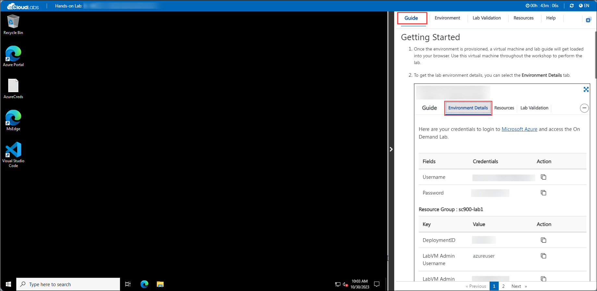
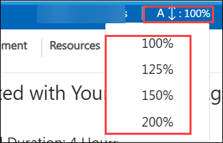
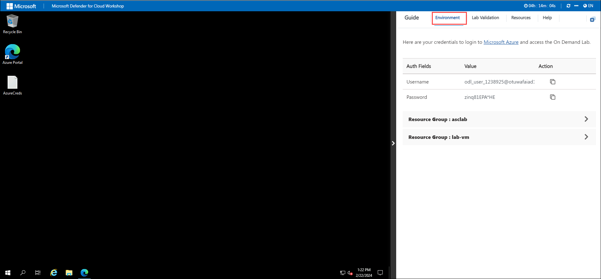
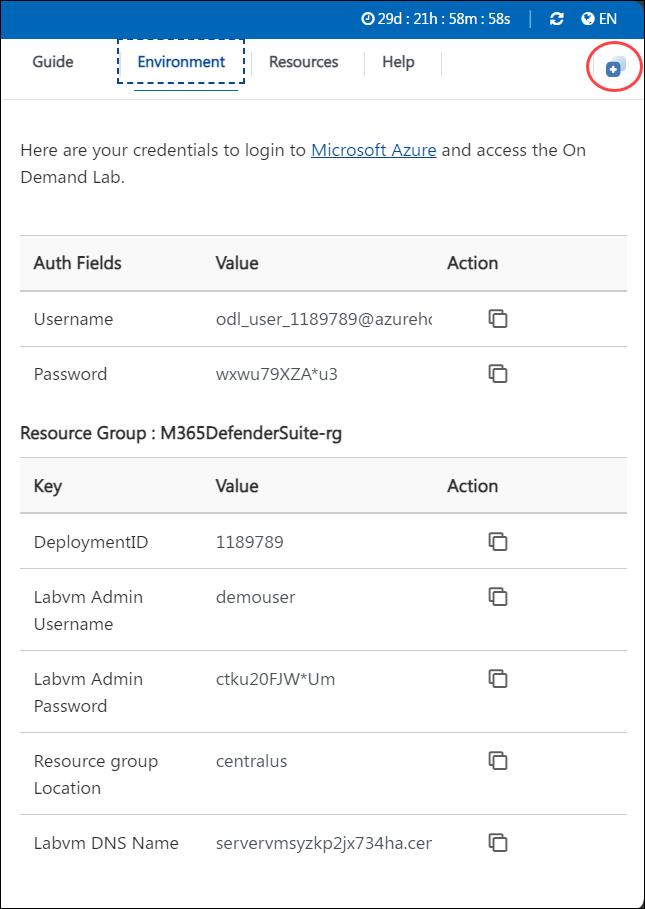
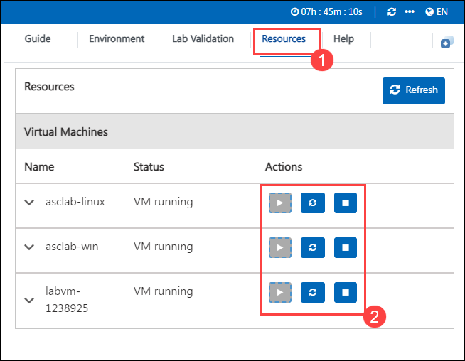

# Cloud-Security-with-Microsoft-Defender-for-Cloud

## Overview

This hands-on workshop series is designed to equip participants with practical experience in strengthening cloud security using **Microsoft Defender for Cloud**, **Microsoft Sentinel**, and integrated threat protection services. Over three days, you'll explore security monitoring, policy enforcement, regulatory compliance, and secure DevOps practices to protect your Azure environment. By the end of this workshop, you'll gain comprehensive, hands-on expertise in identifying, mitigating, and responding to security threats in the cloud.

## Objectives

* Learn how to enable and configure Microsoft Defender for various Azure resources including VMs, Storage, and SQL.
* Implement and manage security policies to enforce compliance across subscriptions and resource groups.
* Monitor, investigate, and respond to security threats and alerts.
* Secure CI/CD pipelines by integrating Microsoft Defender for Cloud with GitHub and Azure DevOps.
* Visualize and investigate cloud attack surfaces using Microsoft Defender ESAM.
* Integrate Microsoft Defender with Microsoft Sentinel for advanced alert investigation and response.

## Day-by-Day Breakdown:

### Day 1: Microsoft Defender for Core Resource Protection

This hands-on lab focuses on enabling foundational security protections across your Azure environment. You will learn to enable Microsoft Defender for essential services such as Azure Storage and SQL VMs, as well as how to apply security policies effectively.

**Labs Covered:**

* **Getting Started with Microsoft Defender for Cloud**: Enable core security posture management and threat protection across Azure.
* **Securing Azure Storage with Microsoft Defender**: Protect against data exfiltration and malware by enabling Defender for Storage.
* **Protecting SQL Servers on Azure Virtual Machines**: Detect threats on SQL VMs using Defender for SQL.
* **Managing Security Policies in Microsoft Defender for Cloud**: Apply compliance policies across subscriptions and resource groups.

### Day 2: Compliance and Security Baselines

This day emphasizes regulatory compliance, standardized configurations, and alert handling. You’ll evaluate compliance scores, secure VMs using built-in baselines, and learn how to investigate alerts in Defender.

**Labs Covered:**

* **Enhancing Compliance with Defender for Cloud**: Monitor and improve compliance against regulatory standards.
* **Securing VMs with Azure Security Baselines**: Apply Microsoft-recommended baseline configurations to protect virtual machines.
* **Investigating and Responding to Security Alerts**: Analyze real-world alerts and apply remediation actions.

### Day 3: Defender for DevOps and Advanced Threat Detection

On the final day, you'll shift focus to securing development environments and enhancing threat detection using advanced tools. You will secure your DevOps pipelines, explore attack surface management, and integrate Defender with Microsoft Sentinel for AI-powered investigation.

**Labs Covered:**

* **Securing Code Repositories with Microsoft Defender for Cloud**: Integrate and monitor GitHub and Azure DevOps repositories for pipeline security risks.
* **Deploying and Utilizing Microsoft Defender ESAM in Azure**: Visualize your cloud’s attack surface and understand exposure paths using ESAM.
* **Advanced Alert Investigation with Microsoft Defender and Sentinel**: Use Microsoft Sentinel and Defender integration for cross-platform alert correlation and AI-driven threat investigation

# Getting Started with Your Microsoft Defender for Cloud Workshop
 
Welcome to your Microsoft Defender for Cloud Workshop! We've prepared a seamless environment for you to explore and learn about integrating, transforming, and consolidating data from various structured, unstructured, and streaming data systems into a suitable schema for building analytics solutions. Let's begin by making the most of this experience:
 
## Accessing Your Lab Environment
 
Once you're ready to dive in, your virtual machine and **Guide** will be right at your fingertips within your web browser.
 

## Lab Guide Zoom In/Zoom Out

To adjust the zoom level for the environment page, click the **A↕ : 100%** icon located next to the timer in the lab environment.

  

## Virtual Machine & Lab Guide

Your virtual machine is your workhorse throughout the workshop. The lab guide is your roadmap to success.

## Exploring Your Lab Resources

To get a better understanding of your lab resources and credentials, navigate to the **Environment** tab.

## Utilizing the Split Window Feature

For convenience, you can open the lab guide in a separate window by selecting the **Split Window** button from the Top right corner.

## Managing Your Virtual Machine

Feel free to **start, stop, or restart (2)** your virtual machine as needed from the **Resources (1)** tab. Your experience is in your hands!

> **Note:** Please ensure the script continues to run and is not terminated after accessing the environment.

## Let's Get Started with Azure Portal

1. On your virtual machine, click on the Azure Portal icon.
2. You'll see the **Sign into Microsoft Azure** tab. Here, enter your credentials:

   - **Email/Username:** <inject key="AzureAdUserEmail"></inject>

     

3. Next, provide your password:

   - **Password:** <inject key="AzureAdUserPassword"></inject>

     

4. If **Action required** pop-up window appears, click on **Ask later**.
5. If prompted to **stay signed in**, you can click **No**.
6. If a **Welcome to Microsoft Azure** pop-up window appears, simply click **"Cancel"** to skip the tour.

## Steps to Proceed with MFA Setup if "Ask Later" Option is Not Visible

1. At the **"More information required"** prompt, select **Next**.

1. On the **"Keep your account secure"** page, select **Next** twice.

1. **Note:** If you don’t have the Microsoft Authenticator app installed on your mobile device:

   - Open **Google Play Store** (Android) or **App Store** (iOS).
   - Search for **Microsoft Authenticator** and tap **Install**.
   - Open the **Microsoft Authenticator** app, select **Add account**, then choose **Work or school account**.

1. A **QR code** will be displayed on your computer screen.

1. In the Authenticator app, select **Scan a QR code** and scan the code displayed on your screen.

1. After scanning, click **Next** to proceed.

1. On your phone, enter the number shown on your computer screen in the Authenticator app and select **Next**.
1. If prompted to stay signed in, you can click "No."

1. If a **Welcome to Microsoft Azure** pop-up window appears, simply click "Maybe Later" to skip the tour.

## Support Contact

The CloudLabs support team is available 24/7, 365 days a year, via email and live chat to ensure seamless assistance at any time. We offer dedicated support channels tailored specifically for both learners and instructors, ensuring that all your needs are promptly and efficiently addressed.

Learner Support Contacts:

- Email Support: [cloudlabs-support@spektrasystems.com](mailto:cloudlabs-support@spektrasystems.com)
- Live Chat Support: https://cloudlabs.ai/labs-support

Click **Next** from the bottom right corner to embark on your Lab journey!

.png)

Now you're all set to explore the powerful world of technology. Feel free to reach out if you have any questions along the way. Enjoy your workshop!